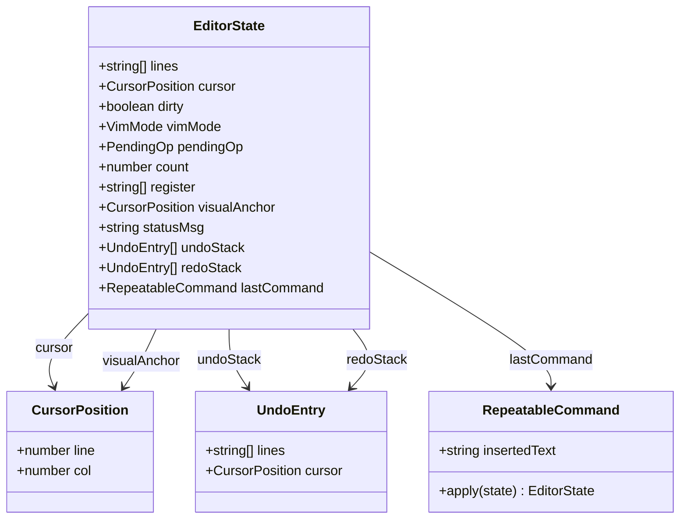
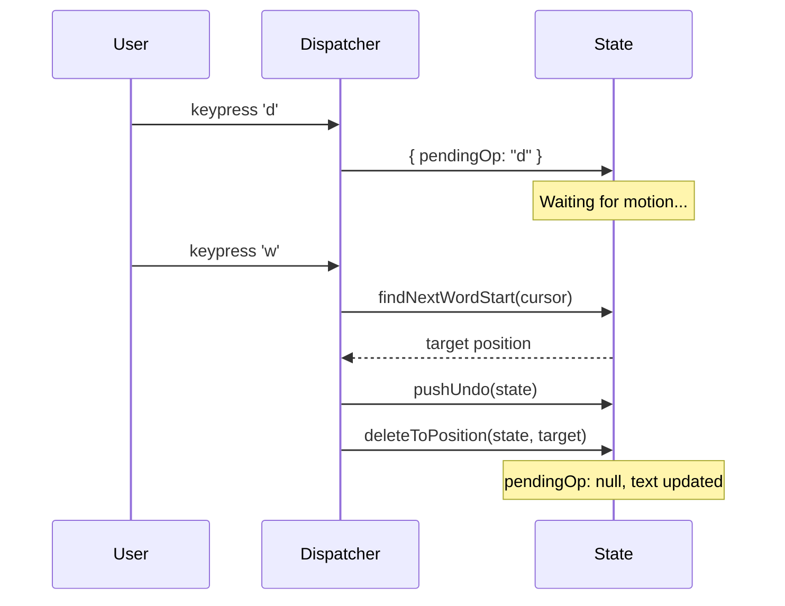
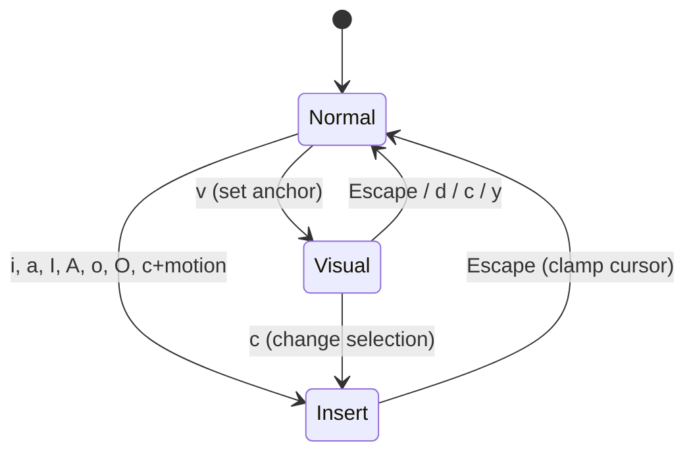
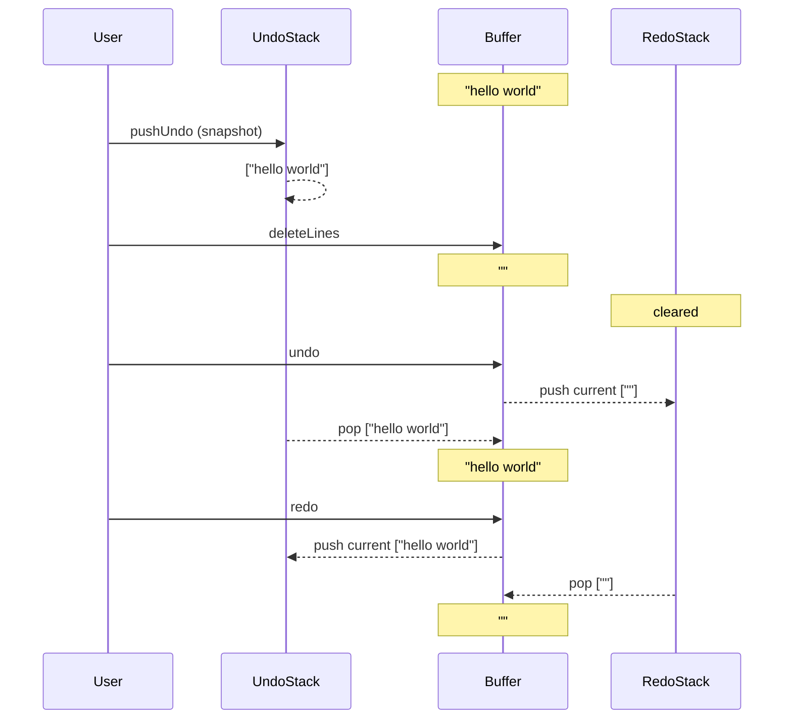

## Building a Vim Editor as a Pure State Machine

[Obsitui](https://github.com/atr0t0s/obsitui) is a terminal UI for browsing and managing Obsidian vaults. It's built with Ink (React for CLI) and TypeScript -- a full TUI with fuzzy search, graph view, AI chat, and rich markdown rendering. The kind of tool where you live inside your terminal and never touch the mouse.

It needed an inline editor. The obvious approach was to shell out to `$EDITOR` -- and Obsitui supports that -- but it breaks the TUI flow. You leave the app, your editor opens, you save and quit, and the app has to figure out what changed. It works, but it's clunky. For quick edits, I wanted something that stayed inside the terminal, right there in the same React render loop.

And if you're building a terminal editor for people who already use a terminal to manage their notes, vim keybindings aren't optional. They're expected.

The design decision that shaped everything else: every editing operation is a pure function. The type signature is always `(EditorState, Input) -> EditorState`. No mutation, no side effects, no `this`. You pass in a state, you get back a new state. The React component just calls `setState` with the result.

This sounds like an academic nicety, but it has concrete consequences. Testing becomes trivial -- you just construct a state, call a function, and assert on the result. Undo and redo fall out for free as a stack of snapshots. Dot repeat (vim's `.` command) is just "store the last function, call it again." I didn't plan these as features to implement. They emerged from the architecture.

The rest of this article walks through the implementation: 867 lines of TypeScript that cover the core vim editing model. I'll go through the state representation, motions, operator composition, mode transitions, visual mode, undo/redo, and dot repeat. All code is from the actual source file, not pseudocode.

### The State

Everything lives in a single `EditorState` interface:

```typescript
export interface EditorState {
  lines: string[];
  cursor: CursorPosition;
  dirty: boolean;
  vimMode: VimMode;
  /** Pending operator: d, c, y — waits for a motion. r — waits for a char. */
  pendingOp: "d" | "c" | "y" | "r" | null;
  /** Count prefix: e.g. 3 in 3dd */
  count: number;
  /** Yank register (single register for simplicity) */
  register: string[];
  /** Visual mode anchor (where selection started) */
  visualAnchor: CursorPosition | null;
  /** Status message shown briefly in footer */
  statusMsg: string;
  /** Undo stack */
  undoStack: UndoEntry[];
  /** Redo stack */
  redoStack: UndoEntry[];
  /** Last repeatable command for . (dot) */
  lastCommand: RepeatableCommand | null;
}
```

The supporting types are small:

```typescript
export interface CursorPosition {
  line: number;   // 0-based line index
  col: number;    // 0-based column index
}

export type VimMode = "normal" | "insert" | "visual";

export interface UndoEntry {
  lines: string[];
  cursor: CursorPosition;
}

export interface RepeatableCommand {
  /** Replay function: takes state, returns new state (with pushUndo already included) */
  apply: (state: EditorState) => EditorState;
  /** Text typed during insert mode session following the command */
  insertedText?: string;
}
```



A few things worth pointing out. The buffer is `lines: string[]` -- an array of strings, one per line. Not a gap buffer, not a rope, not a piece table. Just an array. This is the simplest possible representation and it's fine for the file sizes you'd encounter editing notes in an Obsidian vault. I'll discuss the performance tradeoffs later.

The `pendingOp` field is what makes vim's grammar work. When you press `d`, nothing happens to the text yet. The state just records that an operator is pending, waiting for a motion. When the motion arrives, the dispatcher combines the operator with the motion to produce the actual edit. This is the key mechanism for composing operators with motions.

The `register` is a single `string[]`. Real vim has 26 named registers plus a handful of special ones. I have one. It holds whatever was last yanked or deleted, and paste puts it back. This covers the vast majority of actual editing workflows.

Creating a fresh state is straightforward:

```typescript
export function createEditorState(content: string): EditorState {
  const lines = content.split("\n");
  if (lines.length === 0) lines.push("");
  return {
    lines,
    cursor: { line: 0, col: 0 },
    dirty: false,
    vimMode: "normal",
    pendingOp: null,
    count: 0,
    register: [],
    visualAnchor: null,
    statusMsg: "",
    undoStack: [],
    redoStack: [],
    lastCommand: null,
  };
}
```

Split on newlines, ensure there's at least one line (even for empty content), and initialize everything to its zero value. The editor starts in normal mode, as vim does.

### Motions

Motions are the simplest category of operation. They take state, change only the cursor position, and return new state. Nothing else is modified.

The basic directional motions (`h`, `j`, `k`, `l`) go through `moveCursor`:

```typescript
export function moveCursor(
  state: EditorState,
  direction: "up" | "down" | "left" | "right" | "home" | "end",
): EditorState {
  const { lines, cursor, vimMode } = state;
  const isNormal = vimMode === "normal";
  let { line, col } = cursor;

  switch (direction) {
    case "up":
      if (line > 0) {
        line--;
        col = clampCol(lines, line, col, isNormal);
      }
      break;
    case "down":
      if (line < lines.length - 1) {
        line++;
        col = clampCol(lines, line, col, isNormal);
      }
      break;
    case "left":
      if (col > 0) {
        col--;
      } else if (line > 0 && !isNormal) {
        line--;
        col = (lines[line] ?? "").length;
      }
      break;
    case "right": {
      const maxR = isNormal ? lastCol(lines, line) : (lines[line] ?? "").length;
      if (col < maxR) {
        col++;
      } else if (line < lines.length - 1 && !isNormal) {
        line++;
        col = 0;
      }
      break;
    }
    case "home":
      col = 0;
      break;
    case "end":
      col = isNormal ? lastCol(lines, line) : (lines[line] ?? "").length;
      break;
  }

  return { ...state, cursor: { line, col } };
}
```

There's a subtle but important detail here: cursor clamping differs between modes. In normal mode, the cursor sits *on* characters, so it can't go past the last character (column `length - 1`). In insert mode, the cursor sits *between* characters, so it can be at position `length` (after the last character). This distinction shows up everywhere and getting it wrong produces off-by-one bugs that are maddening to track down.

Word motions are more interesting. Vim recognizes three character classes: word characters (`\w`), whitespace (`\s`), and everything else (punctuation). The `w` motion skips past the current class, then past any whitespace, landing on the start of the next word. Here's `findNextWordStart`:

```typescript
export function findNextWordStart(lines: string[], cursor: CursorPosition): CursorPosition {
  let { line, col } = cursor;
  const text = lines[line] ?? "";

  if (col >= text.length && line < lines.length - 1) {
    // At end of line, jump to next line
    line++;
    const nextLine = lines[line] ?? "";
    const nb = nextLine.match(/\S/);
    return { line, col: nb ? nb.index! : 0 };
  }

  // Skip current word/punctuation class
  const startCh = text[col] ?? "";
  if (isWordChar(startCh)) {
    while (col < text.length && isWordChar(text[col]!)) col++;
  } else if (!isWhitespace(startCh)) {
    while (col < text.length && !isWordChar(text[col]!) && !isWhitespace(text[col]!)) col++;
  }
  // Skip whitespace
  while (col < text.length && isWhitespace(text[col]!)) col++;

  if (col >= text.length && line < lines.length - 1) {
    line++;
    const nextLine = lines[line] ?? "";
    const nb = nextLine.match(/\S/);
    return { line, col: nb ? nb.index! : 0 };
  }
  return { line, col: Math.min(col, (lines[line] ?? "").length) };
}
```

The three-class logic creates the behavior vim users expect: in `foo.bar`, pressing `w` from `f` goes to `.`, not to `b`. The punctuation is its own word. The `b` and `e` motions (`findPrevWordStart`, `findWordEnd`) follow the same class logic in their respective directions.

Line motions are simpler. `0` goes to column 0. `$` goes to the last column. `^` goes to the first non-whitespace character, using a helper:

```typescript
function firstNonBlank(line: string): number {
  const match = line.match(/\S/);
  return match ? match.index! : 0;
}
```

Document motions: `gg` goes to line 0, `G` goes to the last line. These are handled in the dispatcher rather than as standalone functions.

Find motions (`f` and `F`) search for a character on the current line:

```typescript
export function findCharForward(lines: string[], cursor: CursorPosition, char: string): CursorPosition | null {
  const line = lines[cursor.line] ?? "";
  const idx = line.indexOf(char, cursor.col + 1);
  if (idx === -1) return null;
  return { line: cursor.line, col: idx };
}

export function findCharBackward(lines: string[], cursor: CursorPosition, char: string): CursorPosition | null {
  const line = lines[cursor.line] ?? "";
  const idx = line.lastIndexOf(char, cursor.col - 1);
  if (idx === -1) return null;
  return { line: cursor.line, col: idx };
}
```

They return `null` if the character isn't found, which the dispatcher handles by doing nothing.

Bracket matching (`%`) is the most involved motion. It uses a depth-counting algorithm that handles nesting:

```typescript
export function findMatchingBracket(lines: string[], cursor: CursorPosition): CursorPosition | null {
  const line = lines[cursor.line] ?? "";
  const ch = line[cursor.col];
  if (!ch) return null;

  const pairs: Record<string, { match: string; dir: 1 | -1 }> = {
    "(": { match: ")", dir: 1 },
    ")": { match: "(", dir: -1 },
    "[": { match: "]", dir: 1 },
    "]": { match: "[", dir: -1 },
    "{": { match: "}", dir: 1 },
    "}": { match: "{", dir: -1 },
  };

  const pair = pairs[ch];
  if (!pair) return null;

  let depth = 1;
  let l = cursor.line;
  let c = cursor.col + pair.dir;

  while (l >= 0 && l < lines.length) {
    const curLine = lines[l] ?? "";
    while (c >= 0 && c < curLine.length) {
      if (curLine[c] === ch) depth++;
      else if (curLine[c] === pair.match) depth--;
      if (depth === 0) return { line: l, col: c };
      c += pair.dir;
    }
    l += pair.dir;
    if (l >= 0 && l < lines.length) {
      c = pair.dir === 1 ? 0 : (lines[l] ?? "").length - 1;
    }
  }

  return null;
}
```

The `dir` field determines the scan direction: `1` for opening brackets (scan forward), `-1` for closing brackets (scan backward). Each time we encounter the same bracket type, depth increments. Each time we encounter the matching bracket, depth decrements. When depth hits zero, we've found the match. This works across lines and handles arbitrary nesting depth.

### Operators and Composition

Vim has a grammar: `[count][operator][motion]`. You can combine any operator with any motion. `dw` deletes a word. `d$` deletes to end of line. `cw` changes a word. The operator says *what* to do, the motion says *over what range*.

The mechanism is `pendingOp`. When you press `d` in normal mode, the dispatcher doesn't delete anything. It sets `pendingOp: "d"` and returns. The state now looks like this:

```typescript
{ ...state, pendingOp: "d" }
```

On the next keypress, the dispatcher checks `pendingOp`. If the key is a motion, it computes the target position, then applies the operator over the range from the current cursor to the target. If the key isn't a valid motion, it cancels the pending operation.

Let me walk through `dw` (delete word) step by step.

Starting state: cursor at column 0 of `"hello world"`.

1. User presses `d`. Dispatcher sets `pendingOp: "d"`. No text changes.
2. User presses `w`. Dispatcher sees `pendingOp === "d"`, so it calls `findNextWordStart` to get the target position: `{ line: 0, col: 6 }` (the `w` in `world`). Then it calls `pushUndo(state)` to snapshot the current state, and `deleteToPosition(state, target)` to perform the deletion.
3. Result: `"world"`, cursor at column 0, and `"hello "` is in the register.



`deleteToPosition` handles both same-line and multi-line cases:

```typescript
export function deleteToPosition(state: EditorState, target: CursorPosition): EditorState {
  const { lines, cursor } = state;
  // Determine range
  let startLine = cursor.line;
  let startCol = cursor.col;
  let endLine = target.line;
  let endCol = target.col;

  // Normalize so start <= end
  if (startLine > endLine || (startLine === endLine && startCol > endCol)) {
    [startLine, startCol, endLine, endCol] = [endLine, endCol, startLine, startCol];
  }

  if (startLine === endLine) {
    // Same line — delete from startCol to endCol
    const line = lines[startLine] ?? "";
    const yanked = line.slice(startCol, endCol);
    const newLine = line.slice(0, startCol) + line.slice(endCol);
    const newLines = [...lines];
    newLines[startLine] = newLine;
    return {
      ...state,
      lines: newLines,
      cursor: { line: startLine, col: clampCol(newLines, startLine, startCol, true) },
      register: [yanked],
      dirty: true,
      pendingOp: null,
      count: 0,
      statusMsg: "",
    };
  }

  // Multi-line deletion
  const firstLine = lines[startLine] ?? "";
  const lastLine = lines[endLine] ?? "";
  const yanked = [
    firstLine.slice(startCol),
    ...lines.slice(startLine + 1, endLine),
    lastLine.slice(0, endCol),
  ];
  const merged = firstLine.slice(0, startCol) + lastLine.slice(endCol);
  const newLines = [...lines];
  newLines.splice(startLine, endLine - startLine + 1, merged);
  if (newLines.length === 0) newLines.push("");
  return {
    ...state,
    lines: newLines,
    cursor: { line: startLine, col: clampCol(newLines, startLine, startCol, true) },
    register: yanked,
    dirty: true,
    pendingOp: null,
    count: 0,
    statusMsg: "",
  };
}
```

The normalization step at the top is important: it ensures start is always before end, regardless of whether the motion went forward or backward. This means `db` (delete backward to previous word start) works correctly without any special casing.

For the same-line case, it's straightforward string slicing: take everything before the start and everything after the end, concatenate, done. The deleted text goes into the register.

The multi-line case is slightly more involved. It takes the beginning of the first line (before the start column), the end of the last line (after the end column), and merges them into one line. Everything in between is captured in the register and removed.

`changeToPosition` -- the `c` operator applied to a motion -- is a one-liner:

```typescript
export function changeToPosition(state: EditorState, target: CursorPosition): EditorState {
  const deleted = deleteToPosition(state, target);
  return { ...deleted, vimMode: "insert" };
}
```

A change is a delete that enters insert mode. That's it. Because `deleteToPosition` already handles all the range logic, character yanking, and cursor positioning, the change variant just flips the mode. This is the kind of thing that falls out naturally when operations are composable.

Similarly, `changeToEndOfLine` builds on `deleteToEndOfLine`:

```typescript
export function changeToEndOfLine(state: EditorState): EditorState {
  const deleted = deleteToEndOfLine(state);
  const line = deleted.lines[deleted.cursor.line] ?? "";
  return {
    ...deleted,
    cursor: { line: deleted.cursor.line, col: line.length },
    vimMode: "insert",
  };
}
```

Line-wise operations follow the same pattern but operate on whole lines. `dd` calls `deleteLines`, which splices lines out of the array:

```typescript
export function deleteLines(state: EditorState, count: number): EditorState {
  const { lines, cursor } = state;
  const start = cursor.line;
  const end = Math.min(start + count, lines.length);
  const yanked = lines.slice(start, end);
  const newLines = [...lines];
  newLines.splice(start, end - start);
  if (newLines.length === 0) newLines.push("");
  const newLine = Math.min(start, newLines.length - 1);
  const col = firstNonBlank(newLines[newLine] ?? "");
  return {
    ...state,
    lines: newLines,
    cursor: { line: newLine, col },
    dirty: true,
    register: yanked,
    pendingOp: null,
    count: 0,
    statusMsg: count > 1 ? `${count} lines deleted` : "",
  };
}
```

The `count` parameter handles numeric prefixes: `3dd` deletes three lines. The guard `if (newLines.length === 0) newLines.push("")` ensures the buffer always has at least one line -- you can't have a truly empty document. After deletion, the cursor moves to the first non-blank character of the line that's now at the deleted position, matching vim's behavior.

`yy` (yank lines) and `cc` (change line) follow the same structure. `D` and `d$` call `deleteToEndOfLine`, `d0` calls `deleteToStartOfLine`. Each is a small function that handles its specific case, and the dispatcher maps keystrokes to the right one.

### Mode Transitions

The editor has three modes: Normal, Insert, and Visual. Every mode transition is an explicit function call that returns a new state.



From Normal to Insert, there are multiple entry points, each positioning the cursor differently:

- `i` (`enterInsertMode`): insert at current position
- `a` (`enterInsertAfter`): insert after current position (cursor moves right one)
- `I` (`enterInsertAtLineStart`): insert at first non-blank character
- `A` (`enterInsertAtLineEnd`): insert at end of line
- `o` (`openLineBelow`): open new line below, enter insert
- `O` (`openLineAbove`): open new line above, enter insert
- `c` + motion: delete the motion range, enter insert

The transition from Insert back to Normal has a subtlety that catches people who are implementing vim for the first time: the cursor must clamp. In insert mode, the cursor can be at position `length` (after the last character). In normal mode, it can only be at position `length - 1` (on the last character). So when you press Escape, the cursor needs to move left by one:

```typescript
export function enterNormalMode(state: EditorState): EditorState {
  const { lines, cursor } = state;
  // In normal mode, clamp cursor to valid range (can't be past last char)
  const col = clampCol(lines, cursor.line, cursor.col > 0 ? cursor.col - 1 : 0, true);
  return {
    ...state,
    vimMode: "normal",
    cursor: { line: cursor.line, col },
    pendingOp: null,
    count: 0,
    visualAnchor: null,
    statusMsg: "",
  };
}
```

The `cursor.col > 0 ? cursor.col - 1 : 0` handles the edge case where the cursor is already at column 0 -- you can't move left from there. Then `clampCol` with `normalMode = true` ensures we don't exceed `length - 1`.

This function also clears `pendingOp`, `count`, and `visualAnchor`. Escape is a full reset to a clean normal mode state.

Entering visual mode records the current cursor position as the anchor:

```typescript
export function enterVisualMode(state: EditorState): EditorState {
  return {
    ...state,
    vimMode: "visual",
    visualAnchor: { ...state.cursor },
    pendingOp: null,
    count: 0,
    statusMsg: "",
  };
}
```

The selection is always defined as the range between the anchor and the current cursor position. As you move the cursor in visual mode, the selection grows or shrinks. The anchor stays fixed.

### Visual Mode

Visual mode lets you select text and then operate on it. The selection is defined by two points: the anchor (where you pressed `v`) and the cursor (where you've moved to). Since the user can move the cursor either direction, the first thing any visual operation does is normalize the range:

```typescript
export function getVisualRange(state: EditorState): { start: CursorPosition; end: CursorPosition } | null {
  if (!state.visualAnchor) return null;
  const a = state.visualAnchor;
  const b = state.cursor;
  if (a.line < b.line || (a.line === b.line && a.col <= b.col)) {
    return { start: a, end: { line: b.line, col: b.col + 1 } };
  }
  return { start: b, end: { line: a.line, col: a.col + 1 } };
}
```

The `+ 1` on the end column is because visual mode in vim is inclusive -- the character under the cursor is part of the selection. The range returned from `getVisualRange` is half-open `[start, end)`, so the `+ 1` makes it include the cursor character.

With the range normalized, the operations reuse existing primitives. `deleteVisualSelection`:

```typescript
export function deleteVisualSelection(state: EditorState): EditorState {
  const range = getVisualRange(state);
  if (!range) return { ...state, vimMode: "normal", visualAnchor: null };
  // Move cursor to start of range so deleteToPosition deletes from start→end
  const withCursorAtStart = { ...state, cursor: range.start };
  const result = deleteToPosition(withCursorAtStart, range.end);
  return {
    ...result,
    cursor: { line: range.start.line, col: clampCol(result.lines, range.start.line, range.start.col, true) },
    vimMode: "normal",
    visualAnchor: null,
  };
}
```

It positions the cursor at the start of the range, then calls `deleteToPosition` with the end -- the same function used by `d` + motion in normal mode. Then it cleans up by switching back to normal mode and clearing the anchor.

`changeVisualSelection` is the same pattern: delete the selection, but enter insert mode instead of normal:

```typescript
export function changeVisualSelection(state: EditorState): EditorState {
  const range = getVisualRange(state);
  if (!range) return { ...state, vimMode: "normal", visualAnchor: null };
  const withCursorAtStart = { ...state, cursor: range.start };
  const result = deleteToPosition(withCursorAtStart, range.end);
  return {
    ...result,
    cursor: { line: range.start.line, col: range.start.col },
    vimMode: "insert",
    visualAnchor: null,
  };
}
```

`yankVisualSelection` copies without deleting:

```typescript
export function yankVisualSelection(state: EditorState): EditorState {
  const range = getVisualRange(state);
  if (!range) return { ...state, vimMode: "normal", visualAnchor: null };
  const { start, end } = range;
  const { lines } = state;

  let yanked: string[];
  if (start.line === end.line) {
    yanked = [(lines[start.line] ?? "").slice(start.col, end.col)];
  } else {
    yanked = [
      (lines[start.line] ?? "").slice(start.col),
      ...lines.slice(start.line + 1, end.line),
      (lines[end.line] ?? "").slice(0, end.col),
    ];
  }

  return {
    ...state,
    register: yanked,
    vimMode: "normal",
    visualAnchor: null,
    statusMsg: "yanked",
  };
}
```

Same pattern again. Visual mode operations are thin wrappers around `deleteToPosition` and `getVisualRange`. The only difference between delete, change, and yank is what happens after computing the range: remove it and stay in normal mode, remove it and enter insert, or copy it and leave the text alone.

### Undo/Redo

The undo system is snapshot-based. Before any mutating operation, you call `pushUndo` to capture the current state:

```typescript
export function pushUndo(state: EditorState): EditorState {
  const entry: UndoEntry = {
    lines: [...state.lines],
    cursor: { ...state.cursor },
  };
  return {
    ...state,
    undoStack: [...state.undoStack, entry],
    redoStack: [], // clear redo on new change
  };
}
```

An `UndoEntry` is just `{ lines, cursor }` -- a copy of the buffer contents and cursor position. The spread operators create shallow copies so the snapshot is independent of future mutations. Pushing an undo entry also clears the redo stack, because any new change invalidates the redo timeline.

Undo pops the last entry and restores it, pushing the current state onto the redo stack:

```typescript
export function undo(state: EditorState): EditorState {
  if (state.undoStack.length === 0) {
    return { ...state, statusMsg: "Already at oldest change" };
  }
  const stack = [...state.undoStack];
  const entry = stack.pop()!;
  const redoEntry: UndoEntry = {
    lines: [...state.lines],
    cursor: { ...state.cursor },
  };
  return {
    ...state,
    lines: entry.lines,
    cursor: entry.cursor,
    undoStack: stack,
    redoStack: [...state.redoStack, redoEntry],
    vimMode: "normal",
    pendingOp: null,
    count: 0,
    visualAnchor: null,
    dirty: stack.length > 0,
    statusMsg: "",
  };
}
```

Redo is the mirror image -- pop from redo stack, push to undo stack:

```typescript
export function redo(state: EditorState): EditorState {
  if (state.redoStack.length === 0) {
    return { ...state, statusMsg: "Already at newest change" };
  }
  const stack = [...state.redoStack];
  const entry = stack.pop()!;
  const undoEntry: UndoEntry = {
    lines: [...state.lines],
    cursor: { ...state.cursor },
  };
  return {
    ...state,
    lines: entry.lines,
    cursor: entry.cursor,
    undoStack: [...state.undoStack, undoEntry],
    redoStack: stack,
    vimMode: "normal",
    pendingOp: null,
    count: 0,
    visualAnchor: null,
    dirty: true,
    statusMsg: "",
  };
}
```



Why snapshots instead of operational transform or command-based undo? Simplicity. With snapshots, undo is always correct -- you restore exactly what was there before. There's no need to define inverse operations for every editing command, no need to worry about command composition breaking undo boundaries, and no subtle bugs from inverse operations that don't quite match their forward counterparts.

The cost is memory. Every undo entry stores a complete copy of all lines. For the file sizes typical of Obsidian notes (a few KB to maybe tens of KB), this is negligible. You could have hundreds of undo levels and barely notice the memory. For a general-purpose editor working on megabyte files, you'd want something smarter. For this use case, snapshots are the right tradeoff.

Both `undo` and `redo` reset the editor to normal mode and clear any pending operations. This matches vim's behavior and prevents you from ending up in a weird state after undoing.

### Dot Repeat

Vim's `.` command repeats the last change. It's one of those features that seems minor until you use it, and then you can't live without it. "Delete a word, move to the next occurrence, press `.`, done."

The mechanism is the `RepeatableCommand` interface:

```typescript
export interface RepeatableCommand {
  /** Replay function: takes state, returns new state (with pushUndo already included) */
  apply: (state: EditorState) => EditorState;
  /** Text typed during insert mode session following the command */
  insertedText?: string;
}
```

When the dispatcher executes a repeatable operation (deletes, changes, inserts), it captures a closure in `lastCommand.apply` that can replay that operation on any future state. When the user presses `.`, the dispatcher calls `lastCommand.apply(currentState)` and gets back the new state.

The `insertedText` field handles commands that enter insert mode. When you do `cw` followed by typing "foo" and pressing Escape, the dot command needs to replay the entire sequence: delete a word, insert "foo". The dispatcher accumulates the inserted text during the insert mode session and attaches it to the `RepeatableCommand` when you leave insert mode.

This is where pure functions make dot repeat natural rather than painful. Because every operation is `(State) -> State` with no hidden side effects, capturing "what happened" is just capturing the function that did it. There's no need to record a sequence of imperative steps or replay a macro of keystrokes. The operation *is* the function.

To make this concrete: when the dispatcher handles `dw`, it constructs something like this (simplified):

```typescript
const target = findNextWordStart(state.lines, state.cursor);
const newState = deleteToPosition(pushUndo(state), target);
newState.lastCommand = {
  apply: (s: EditorState) => {
    const t = findNextWordStart(s.lines, s.cursor);
    return deleteToPosition(pushUndo(s), t);
  }
};
```

The closure captures the *operation* (delete to next word start), not the *specific positions*. When `.` replays it, `findNextWordStart` runs fresh against the current cursor and buffer. So if you `dw` at the start of "hello world", then move to "foo bar" and press `.`, it deletes "foo " -- the right thing relative to where you are now.

In a mutable editor, you'd typically implement this by recording keystrokes or maintaining a command journal. With pure functions, the command *is* a function. Storing it is trivial. Replaying it is a function call. The only complexity is `insertedText` -- when a command enters insert mode, the text the user types must be captured separately and replayed as a sequence of `insertChar` calls during repeat. It works, but it's the one place where the pattern stretches slightly.

### Testing

Because every operation is a pure function, testing is about as simple as it can get. The pattern is always:

1. Create an `EditorState` with `createEditorState`
2. Call the function you're testing
3. Assert on the result

No mocking, no DOM, no async, no setup beyond constructing the initial state. Here are a few real examples from the test suite:

```typescript
it("w moves to start of next word", () => {
  const state = createEditorState("hello world foo");
  const pos = findNextWordStart(state.lines, { line: 0, col: 0 });
  expect(pos.col).toBe(6); // 'w' in world
});
```

```typescript
it("undo restores previous state after delete", () => {
  let state = createEditorState("hello world");
  state = pushUndo(state);
  state = deleteLines(state, 1);
  expect(state.lines).toEqual([""]);
  state = undo(state);
  expect(state.lines).toEqual(["hello world"]);
  expect(state.cursor).toEqual({ line: 0, col: 0 });
});
```

```typescript
it("changes visual selection", () => {
  let state = createEditorState("hello world");
  state = enterVisualMode(state); // anchor at 0,0
  state = { ...state, cursor: { line: 0, col: 5 } };
  const result = changeVisualSelection(state);
  expect(result.lines[0]).toBe("world");
  expect(result.vimMode).toBe("insert");
});
```

The undo test is a good illustration of how the pure function approach plays out. You create state, push an undo snapshot, make a change, assert on the change, undo, and assert on the restoration. It reads like a description of what undo should do.

The test suite has 61 tests and runs in under a second. It covers all the exported functions: cursor movement, word motions, line operations, delete/change with motions, bracket matching, find char, visual mode, undo/redo, and mode transitions.

What's *not* tested at this layer is the dispatcher -- the key handler in the React component that maps keystrokes to function calls. That's where `pendingOp` gets set, where count prefixes accumulate, and where the dot repeat closure gets captured. Testing that would require either testing the React component (which involves Ink's rendering) or extracting the dispatcher into its own pure function (which I haven't done yet). The editor functions themselves are fully tested; the wiring between keystrokes and functions is not.

### Tradeoffs and Limitations

The pure functional approach makes certain things easy and certain things hard.

Testing, as discussed. Undo/redo as stack operations. Dot repeat as a captured closure. Debugging -- when something goes wrong, you can log the state before and after any operation and see exactly what changed. Every function's behavior is fully determined by its inputs, so you can read any function in isolation.

What it makes harder: performance, potentially. Every operation creates a new array with `[...lines]`. For a 1000-line file, that's 1000 references copied on every keystroke. In practice, this is fast enough -- modern JavaScript engines handle this well, and terminal rendering is the actual bottleneck, not array copying. But it means this approach wouldn't scale to editing a 100,000-line log file. That's not the use case, so it's fine.

This is a subset of vim, deliberately. What's not implemented:

- *Multiple registers.* There's one register. No `"a`, `"b`, `"+` for system clipboard, none of that. You get yank and paste with a single anonymous buffer.
- *Text objects.* No `ciw` (change inner word), `da(` (delete around parens), `ci"` (change inside quotes). These are vim's most powerful composability feature and I haven't added them yet. The architecture supports it -- you'd add functions that compute ranges from text objects and plug them into the existing operator machinery -- but it's work I haven't done.
- *Marks.* No `ma` to set a mark, `'a` to jump to it. For note-sized files this is less critical than in a programming editor.
- *Macros.* No `qq` to record, `@q` to replay. Dot repeat covers the single-repeat case; macros would cover multi-step sequences.
- *Ex commands.* The command mode handles `:w`, `:q`, `:wq`, `:q!`, and `:<number>` to jump to a line. No `:s` for search-and-replace, no `:g` for global commands, no `:norm` for applying normal mode commands to ranges.
- *Search.* No `/pattern` search within the editor. The parent TUI has its own search, but the editor buffer itself doesn't.
- *Undo compaction.* The snapshot approach means memory grows linearly with edits. A long editing session on a large file would accumulate significant memory. For the typical use case (editing a note, saving, going back to browsing), this doesn't matter.

The 80/20 of vim: the motions (`hjkl`, `w/b/e`, `0/$`, `gg/G`), the core operators (`d`, `c`, `y`), visual mode, undo, and dot repeat cover the vast majority of actual editing. I can edit notes comfortably with this subset. The missing features are things I notice occasionally, wish for briefly, and work around.

867 lines for a usable vim editor. Not a complete one, but a usable one. The pure state machine approach kept the code small and each piece testable. If I add text objects or search later, they'll plug into the same architecture: compute a range, apply an operator, return new state.
