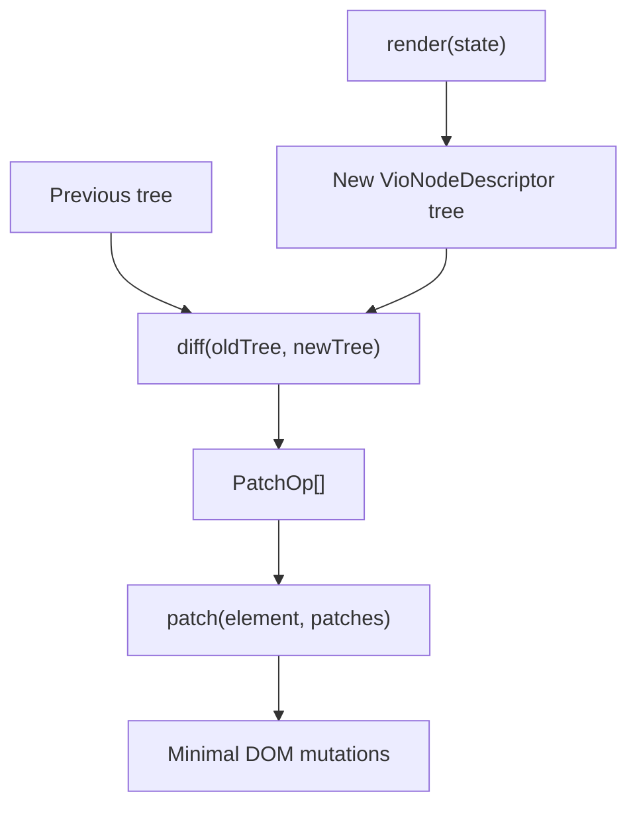
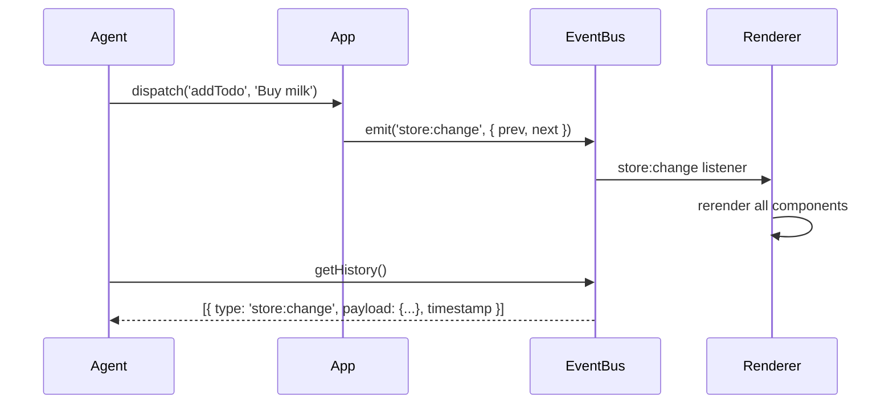

## Building a Frontend Framework for AI Agents

[Vio](https://github.com/atr0t0s/vio) is a frontend framework where components are pure data structures, state is immutable, and everything is observable. It's designed for AI agents to author, introspect, and control web applications programmatically.

This sounds like a niche requirement until you watch an LLM try to write a React component. It generates JSX with mismatched brackets. It puts hooks inside conditionals. It forgets to close a fragment. It invents props that don't exist. These aren't intelligence failures -- they're format failures. The LLM understands what UI it wants to build. It just can't reliably produce the syntax that React demands.

So I built a framework where the syntax is JSON. Where there are no hooks to order incorrectly. Where every operation is an explicit function call, not an implicit side effect. Where an AI agent can read the entire UI state as a serializable tree and manipulate it through a clean imperative API.

The rest of this article walks through why existing frameworks fight AI agents, how Vio's architecture eliminates those problems, the technical implementation of each subsystem, and what it looks like when an agent actually controls a running Vio application.

### Why Existing Frameworks Fight AI Agents

React, Vue, and Svelte are designed for human developers. Their ergonomics optimize for things humans care about: concise syntax, familiar patterns, collocated logic and markup. None of these priorities help an AI agent.

**JSX is a parsing minefield.** JSX interleaves JavaScript expressions with XML-like syntax. An LLM generating a React component needs to track matching angle brackets, curly brace nesting for expressions, self-closing vs. paired tags, fragment syntax, and the distinction between HTML attributes and React props. One misplaced brace and the component won't compile.

```tsx
// What an LLM often generates
<div className="container">
  {items.map(item => (
    <Card key={item.id} title={item.name}>
      {item.active && <Badge status="active" />}
    </Card>
  )}  {/* missing closing paren */}
</div>
```

The equivalent in Vio:

```typescript
{
  tag: 'div',
  props: { class: 'container' },
  children: items.map(item => ({
    tag: Card,
    props: { key: item.id, title: item.name },
    children: item.active ? [{ tag: Badge, props: { status: 'active' } }] : []
  }))
}
```

Pure JavaScript objects. No special syntax. No parser. An LLM that can produce valid JSON can produce valid Vio components.

**Hooks have invisible ordering constraints.** React hooks must be called in the same order on every render. They can't be inside conditionals, loops, or early returns. This is a rule that exists nowhere in the code -- it's a runtime invariant enforced by the framework's internal bookkeeping. LLMs violate it constantly because there's no syntactic signal that the constraint exists.

```tsx
// What an LLM frequently generates -- and it breaks
function UserProfile({ userId }) {
  if (!userId) return null  // early return before hooks

  const [user, setUser] = useState(null)
  useEffect(() => {
    fetchUser(userId).then(setUser)
  }, [userId])

  return <div>{user?.name}</div>
}
```

Vio has no hooks. State is declared once in the component definition and updated through explicit `setState` calls. There's no ordering to get wrong because there's no implicit call sequence.

**Implicit context makes debugging impossible.** React's Context API, Redux's connected components, Vue's `provide`/`inject` -- these create invisible data channels that don't appear in the component's type signature. An AI agent looking at a component can't tell what data it receives from context without tracing the entire component tree.

In Vio, there are exactly two data sources: component-local state (declared in the definition) and the global store (passed explicitly to render). An agent can inspect both with `getState(instanceId)` and `getStore()`. There's nothing hidden.

**No programmatic control surface.** Try writing an AI agent that manipulates a running React app from outside the component tree. You'd need refs, imperative handles, or direct DOM manipulation. The framework doesn't expose its own state to external consumers because it wasn't designed for that use case.

Vio exposes everything through its app API:

```typescript
app.setState(instanceId, { count: 5 })
app.dispatch('toggleTheme')
app.getComponentTree()
app.navigate('/dashboard')
app.batch([...operations])
```

Mutations, navigation, state reads -- all function calls. That's the surface area an agent needs.

### The Design Principles

Five principles drove the design.

**Components are pure data structures.** A Vio component tree is `{ tag, props, children }` -- plain JavaScript objects, all the way down. Not JSX, not template strings, not a custom DSL. Any consumer that can produce a valid object literal can produce a valid Vio tree. This includes LLMs, test harnesses, serialization layers, and automated migration tools.

```typescript
const Counter = defineComponent({
  name: 'Counter',
  state: { count: 0 },
  render(state) {
    return {
      tag: 'div',
      children: [
        `Count: ${state.count}`,
        {
          tag: 'button',
          props: {
            onClick: () => {} // event handlers are just props
          },
          children: ['Increment']
        }
      ]
    }
  }
})
```

**Deterministic pure renders.** Every render function has the signature `(state, store?) -> VioNodeDescriptor`. Same inputs, same output. No reading from closures, no accessing globals, no depending on call order. An agent can predict exactly what the UI will look like for any given state without running the render.

**Immutable state.** All mutations flow through controlled channels: `setState` for component state, `dispatch` for the global store. Every update creates a new state object. The old state is preserved, which means the event bus can emit both `prev` and `next` for every change.

**Observable everything.** Every state change, store dispatch, component mount, route change, and batch operation emits an event on a central bus. An agent can subscribe to `*` and see a complete, timestamped log of everything that happens in the application.

**Full programmatic control.** The `VioApp` interface exposes 12 methods that cover every operation an agent needs:

```typescript
interface VioApp {
  mount(): void
  setState(instanceId: string, partial: Record<string, unknown>): void
  getState(instanceId: string): Record<string, unknown>
  dispatch(action: string, payload?: unknown): void
  getStore(): Record<string, unknown>
  on(event: string, handler: (e: any) => void): () => void
  emit(event: string, payload?: Record<string, unknown>): void
  register(def: ComponentDef): void
  getRegisteredComponents(): string[]
  removeComponent(instanceId: string): void
  getComponentTree(): object
  navigate(path: string): void
  batch(ops: BatchOperation[]): void
}
```

No ref forwarding, no imperative handles. The API is the interface.

### The Component Model

A Vio component is defined with `defineComponent`, which takes a plain object:

```typescript
interface ComponentDef {
  name: string
  state?: Record<string, unknown>
  render: (state: Record<string, unknown>, store?: Record<string, unknown>) => VioNodeDescriptor
  onMount?: (ctx: ComponentContext) => void | (() => void)
  onUpdate?: (ctx: ComponentContext, prevState: Record<string, unknown>) => void
  onUnmount?: (ctx: ComponentContext) => void
}
```

The `name` is a unique string identifier. Components are referenced by name in the registry, not by import. An agent doesn't need to understand a project's module graph to reference a component -- it just needs the name.

The `state` field declares the initial local state as a plain object. No `useState`, no `ref()`, no `$:` reactivity syntax. Just an object with keys and values.

The `render` function takes the current state and optionally the global store, and returns a node descriptor:

```typescript
interface VioNodeDescriptor {
  tag: string | ComponentDef
  props?: Record<string, unknown>
  children?: VioChild[]
  key?: string | number
}

type VioChild = VioNodeDescriptor | string | number | boolean | null | undefined
```

The `tag` can be an HTML tag string (`'div'`, `'button'`, `'input'`) or another `ComponentDef`. When the renderer encounters a `ComponentDef` tag, it calls that component's render function with props merged into state, resolving the tree recursively until everything is plain HTML tags.

Lifecycle hooks receive a `ComponentContext`:

```typescript
interface ComponentContext {
  setState: (partial: Record<string, unknown>) => void
  getState: () => Record<string, unknown>
  emit: (event: string, payload?: unknown) => void
  getRef: (name: string) => HTMLElement | null
}
```

`onMount` runs after the component is rendered and attached to the DOM. It can return a cleanup function that runs on unmount -- the one pattern borrowed from React that actually works well. `onUpdate` fires after any state change with the previous state available for comparison. `onUnmount` fires before the component is removed.

There are no dependency arrays. There's no stale closure problem. The context always reflects the current instance state because it reads from the instance directly, not from a captured closure.

### The Virtual DOM

Vio uses a virtual DOM with a diff/patch algorithm. The render function produces a descriptor tree, and the framework computes the minimal set of DOM mutations needed to reconcile the previous tree with the new one.

The diff function compares two node descriptors and produces a list of patch operations:

```typescript
type PatchOp =
  | { type: 'REPLACE'; newNode: VioNodeDescriptor }
  | { type: 'PROPS'; added: Record<string, unknown>; removed: string[] }
  | { type: 'TEXT'; value: string }
  | { type: 'CHILDREN'; ops: ChildOp[] }

type ChildOp =
  | { type: 'INSERT'; index: number; node: VioChild }
  | { type: 'REMOVE'; index: number }
  | { type: 'PATCH'; index: number; patches: PatchOp[] }
  | { type: 'REPLACE_CHILD'; index: number; node: VioChild }
```

The algorithm is straightforward. If the tags differ, replace the entire node. Otherwise, diff the props (find added, changed, and removed properties) and recursively diff the children:

```typescript
function diff(oldNode: VioNodeDescriptor, newNode: VioNodeDescriptor): PatchOp[] {
  const patches: PatchOp[] = []
  if (oldNode === newNode) return patches

  if (oldNode.tag !== newNode.tag) {
    patches.push({ type: 'REPLACE', newNode })
    return patches
  }

  // Diff props
  const oldProps = oldNode.props ?? {}
  const newProps = newNode.props ?? {}
  const added: Record<string, unknown> = {}
  const removed: string[] = []

  for (const key of Object.keys(newProps)) {
    if (newProps[key] !== oldProps[key]) {
      added[key] = newProps[key]
    }
  }
  for (const key of Object.keys(oldProps)) {
    if (!(key in newProps)) {
      removed.push(key)
    }
  }
  if (Object.keys(added).length > 0 || removed.length > 0) {
    patches.push({ type: 'PROPS', added, removed })
  }

  // Diff children
  const childOps = diffChildren(oldNode.children ?? [], newNode.children ?? [])
  if (childOps.length > 0) {
    patches.push({ type: 'CHILDREN', ops: childOps })
  }

  return patches
}
```

Child diffing compares children by position. For each index, it determines whether the child was inserted, removed, replaced (type changed between primitive and node), or needs recursive patching:

```typescript
function diffChildren(oldChildren: VioChild[], newChildren: VioChild[]): ChildOp[] {
  const ops: ChildOp[] = []
  const maxLen = Math.max(oldChildren.length, newChildren.length)

  for (let i = 0; i < maxLen; i++) {
    const oldChild = i < oldChildren.length ? oldChildren[i] : undefined
    const newChild = i < newChildren.length ? newChildren[i] : undefined

    if (oldChild === undefined || oldChild === null) {
      if (newChild !== undefined && newChild !== null) {
        ops.push({ type: 'INSERT', index: i, node: newChild })
      }
      continue
    }

    if (newChild === undefined || newChild === null) {
      ops.push({ type: 'REMOVE', index: i })
      continue
    }

    if (isPrimitive(oldChild) && isPrimitive(newChild)) {
      if (String(oldChild) !== String(newChild)) {
        ops.push({ type: 'REPLACE_CHILD', index: i, node: newChild })
      }
      continue
    }

    if (isPrimitive(oldChild) !== isPrimitive(newChild)) {
      ops.push({ type: 'REPLACE_CHILD', index: i, node: newChild })
      continue
    }

    if (isNode(oldChild) && isNode(newChild)) {
      const childPatches = diff(oldChild, newChild)
      if (childPatches.length > 0) {
        ops.push({ type: 'PATCH', index: i, patches: childPatches })
      }
    }
  }

  return ops
}
```

Patch application translates the operations into actual DOM mutations. Removals are processed in reverse order to maintain valid indices:

```typescript
function patch(element: HTMLElement, patches: PatchOp[]): void {
  for (const p of patches) {
    switch (p.type) {
      case 'REPLACE': {
        const newEl = createElement(p.newNode)
        element.parentNode?.replaceChild(newEl, element)
        break
      }
      case 'PROPS': {
        for (const [key, value] of Object.entries(p.added)) {
          if (key.startsWith('on') && typeof value === 'function') {
            (element as any)[key.toLowerCase()] = value
          } else if (key === 'class') {
            element.className = String(value)
          } else if (value !== null && value !== undefined && value !== false) {
            element.setAttribute(key, String(value))
          }
        }
        for (const key of p.removed) {
          if (key.startsWith('on')) {
            (element as any)[key.toLowerCase()] = null
          } else {
            element.removeAttribute(key)
          }
        }
        break
      }
      case 'CHILDREN': {
        patchChildren(element, p.ops)
        break
      }
    }
  }
}
```

Event handlers (props starting with `on`) are assigned as DOM properties rather than attributes, so `onClick` becomes `element.onclick = handler`. The `class` prop maps to `className`. Everything else is set as an HTML attribute.



The renderer ties this together. When state changes, it calls the render function with the new state, diffs the result against the stored previous tree, and applies the patches to the real DOM:

```typescript
private rerender(instance: ComponentInstance): void {
  const newTree = this.renderTree(instance.def, instance.state)
  const oldTree = instance.node

  if (oldTree && instance.element) {
    const patches = diff(oldTree, newTree)
    if (patches.length > 0) {
      patch(instance.element, patches)
    }
  }

  instance.node = newTree
}
```

The renderer also resolves component-tag nodes before diffing. When a node's `tag` is a `ComponentDef` rather than a string, the renderer calls that component's render function with props merged into state, recursively, until the entire tree is plain HTML descriptors:

```typescript
private resolveTree(desc: VioNodeDescriptor): VioNodeDescriptor {
  if (typeof desc.tag === 'object' && 'render' in desc.tag) {
    const childDef = desc.tag as ComponentDef
    const childState = { ...(childDef.state ?? {}), ...(desc.props ?? {}) }
    return this.resolveTree(childDef.render(childState))
  }

  if (desc.children) {
    const resolvedChildren = desc.children
      .filter(child => child !== null && child !== undefined && child !== false)
      .map(child => {
        if (child && typeof child === 'object' && 'tag' in child) {
          return this.resolveTree(child)
        }
        return child
      })
    return { ...desc, children: resolvedChildren }
  }

  return desc
}
```

This means the virtual tree that enters the diff algorithm is always flat HTML -- no component boundaries to reconcile across.

### Two-Level State

Vio has two separate state mechanisms.

**Component-local state** is private to each component instance. It's declared in the component definition and updated through `ctx.setState(partial)` or `app.setState(instanceId, partial)`:

```typescript
const Timer = defineComponent({
  name: 'Timer',
  state: { seconds: 0, running: false },
  render(state) {
    return {
      tag: 'div',
      children: [`${state.seconds}s`]
    }
  },
  onMount(ctx) {
    const interval = setInterval(() => {
      const s = ctx.getState()
      if (s.running) {
        ctx.setState({ seconds: (s.seconds as number) + 1 })
      }
    }, 1000)
    return () => clearInterval(interval)
  }
})
```

State updates trigger a re-render of that component. The renderer diffs the old and new trees and patches the DOM. The event bus emits `state:change` with the component name, instance ID, previous state, and new state.

**The global store** holds application-wide state. It uses pure reducer-style actions -- functions that take the current state and a payload, and return new state:

```typescript
const store: StoreConfig = {
  state: { theme: 'light', user: null, todos: [] },
  actions: {
    toggleTheme(state) {
      return { ...state, theme: state.theme === 'light' ? 'dark' : 'light' }
    },
    addTodo(state, text) {
      const todos = state.todos as any[]
      return { ...state, todos: [...todos, { id: Date.now(), text, done: false }] }
    },
    toggleTodo(state, id) {
      const todos = (state.todos as any[]).map(t =>
        t.id === id ? { ...t, done: !t.done } : t
      )
      return { ...state, todos }
    }
  }
}
```

When `app.dispatch('toggleTheme')` is called, the store runs the action, replaces its internal state, emits `store:change` on the event bus, and the renderer re-renders all mounted components. Actions are pure functions -- no async, no side effects, no middleware chain. If you need async operations, you handle them outside the store and dispatch the result.

```typescript
dispatch(action: string, payload?: unknown): void {
  const fn = this.actions[action]
  if (!fn) throw new Error(`Unknown store action: "${action}"`)

  const prevState = { ...this.state }
  this.state = { ...fn(this.state, payload) }

  this.bus.emit('store:change', {
    action,
    payload: payload as Record<string, unknown> ?? {},
    prev: prevState,
    next: { ...this.state }
  })
}
```

Components access the store through the second argument to render:

```typescript
render(state, store) {
  const todos = (store?.todos ?? []) as any[]
  return {
    tag: 'ul',
    children: todos.map(t => ({
      tag: 'li',
      children: [t.text]
    }))
  }
}
```

Component state handles local UI concerns -- is this dropdown open, what's the current input value. The store handles shared application state -- who's logged in, what are the todos. An agent reads them independently: `getState(instanceId)` for local, `getStore()` for global. No component tree traversal.

### The Event Bus

Every mutation in a Vio application emits an event. The event bus is the observability layer that makes agent control practical.

```typescript
class EventBus {
  private listeners = new Map<string, Set<EventHandler>>()
  private history: VioEvent[] = []
  private historySize: number

  on(type: string, handler: EventHandler): () => void {
    if (!this.listeners.has(type)) {
      this.listeners.set(type, new Set())
    }
    this.listeners.get(type)!.add(handler)
    return () => {
      this.listeners.get(type)?.delete(handler)
    }
  }

  emit(type: string, payload: Record<string, unknown> = {}): void {
    const event: VioEvent = {
      type: type as VioEvent['type'],
      payload,
      timestamp: Date.now()
    }

    if (this.historySize > 0) {
      this.history.push(event)
      if (this.history.length > this.historySize) {
        this.history.shift()
      }
    }

    this.listeners.get(type)?.forEach(h => h(event))
    if (type !== '*') {
      this.listeners.get('*')?.forEach(h => h(event))
    }
  }

  getHistory(): VioEvent[] {
    return [...this.history]
  }
}
```

The bus maintains a configurable history (default 100 events). Every event is timestamped. Subscribing to `*` captures everything. The event types cover the full application lifecycle:

```typescript
type VioEventType =
  | 'state:change'     // component state updated
  | 'store:change'     // global store action dispatched
  | 'component:mount'  // component mounted to DOM
  | 'component:update' // component re-rendered
  | 'component:unmount'// component removed from DOM
  | 'route:before'     // navigation about to happen
  | 'route:change'     // route changed
  | 'route:after'      // navigation complete
  | 'batch:start'      // batch operation starting
  | 'batch:end'        // batch operation complete
```

This is what makes agent debugging work. When an agent dispatches an action and the UI doesn't update as expected, it can pull the event history and see exactly what happened: what event fired, what the state was before and after, which components re-rendered. No console.log archaeology, no React DevTools -- just a list of timestamped events with full state snapshots.



### Routing

The router matches URL paths to components with support for parameters, wildcards, and guards:

```typescript
interface Route {
  path: string
  component: ComponentDef
  guard?: (store: Record<string, unknown>) => boolean
}
```

Route definitions are simple:

```typescript
const routes: Route[] = [
  { path: '/', component: HomePage },
  { path: '/users/:id', component: UserDetail },
  { path: '/admin/*', component: AdminPanel, guard: (store) => (store.user as any)?.isAdmin },
  { path: '*', component: NotFound }
]
```

Path parameters (`:id`) are extracted during matching. Guards are functions that receive the current store state and return a boolean -- if the guard returns false, navigation is blocked. This keeps authorization logic declarative and testable.

Navigation emits events on the bus (`route:before`, `route:change`, `route:after`), so an agent can observe navigation as part of the event stream. Programmatic navigation is `app.navigate('/path')`, which updates the hash and triggers the router.

The router currently uses hash-based routing (`#/path`). History API support is planned but not implemented. For agent-controlled applications, hash routing has a practical advantage: the agent can set `window.location.hash` directly without needing server-side configuration.

### Batch Operations

When an agent needs to make multiple changes atomically, individual `setState` and `dispatch` calls would trigger separate re-renders for each operation. Batch operations group them:

```typescript
interface BatchOperation {
  action: 'setState' | 'addComponent' | 'removeComponent' | 'updateProps' | 'dispatch' | 'navigate'
  target?: string
  payload?: unknown
}
```

```typescript
app.batch([
  { action: 'dispatch', payload: { action: 'setUser', value: { name: 'Alice' } } },
  { action: 'setState', target: 'sidebar-1', payload: { expanded: true } },
  { action: 'navigate', target: '/dashboard' }
])
```

The batch emits `batch:start` and `batch:end` events wrapping the individual operations. Each operation within the batch still fires its own events (state:change, store:change, etc.), so the event log shows the complete sequence.

This matters for agents making coordinated changes. "Log in the user, update the sidebar, and navigate to the dashboard" is one atomic intent. Without batching, each step triggers a re-render and the user might see intermediate states. With batching, the operations are applied sequentially within a single frame.

### Agent Control in Practice

Here's what it looks like when an AI agent drives a Vio application. Consider a todo app:

```typescript
const app = createApp({
  root: '#app',
  store: {
    state: { todos: [], filter: 'all' },
    actions: {
      addTodo(state, text) {
        const todos = state.todos as any[]
        return { ...state, todos: [...todos, { id: Date.now(), text, completed: false }] }
      },
      toggleTodo(state, id) {
        const todos = (state.todos as any[]).map(t =>
          t.id === id ? { ...t, completed: !t.completed } : t
        )
        return { ...state, todos }
      },
      deleteTodo(state, id) {
        return { ...state, todos: (state.todos as any[]).filter((t: any) => t.id !== id) }
      },
      setFilter(state, filter) {
        return { ...state, filter }
      }
    }
  },
  routes: [{ path: '/', component: TodoApp }]
})

app.mount()
```

An agent can now do the following:

**Read the current state:**

```typescript
const store = app.getStore()
// { todos: [...], filter: 'all' }

const tree = app.getComponentTree()
// { id: 'TodoApp-1', name: 'TodoApp', state: {...}, children: [] }
```

**Manipulate the application:**

```typescript
app.dispatch('addTodo', 'Buy groceries')
app.dispatch('addTodo', 'Write documentation')
app.dispatch('toggleTodo', 1708891234567)
app.dispatch('setFilter', 'active')
```

**Observe what happened:**

```typescript
app.on('store:change', (event) => {
  console.log(`Action: ${event.payload.action}`)
  console.log(`Prev todos: ${(event.payload.prev as any).todos.length}`)
  console.log(`Next todos: ${(event.payload.next as any).todos.length}`)
})
```

**Make coordinated changes:**

```typescript
app.batch([
  { action: 'dispatch', payload: { action: 'addTodo', value: 'Task 1' } },
  { action: 'dispatch', payload: { action: 'addTodo', value: 'Task 2' } },
  { action: 'dispatch', payload: { action: 'setFilter', value: 'all' } }
])
```

**Debug from the event history:**

```typescript
const history = app.on('*', (event) => {
  // Every event in the application, timestamped
  console.log(`[${event.timestamp}] ${event.type}`, event.payload)
})
```

Compare this to what an agent would need to do in React. To read state, it would need refs or a debug hook into the reconciler. To dispatch actions, it would need access to the dispatch function, which lives inside a component closure. To observe changes, it would need a custom subscriber or the React DevTools protocol. To batch changes, it would need `ReactDOM.flushSync` or `unstable_batchedUpdates`. Every one of these requires reaching into React's internals or setting up explicit bridge code.

In Vio, the control surface is the public API. Nothing extra needed.

### What the Agent Sees

The component tree returned by `getComponentTree()` is a plain JSON-serializable object. An LLM can receive it as context and reason about it directly:

```json
{
  "id": "TodoApp-1",
  "name": "TodoApp",
  "state": { "inputValue": "" },
  "children": []
}
```

Combined with `getStore()`:

```json
{
  "todos": [
    { "id": 1, "text": "Buy groceries", "completed": false },
    { "id": 2, "text": "Write docs", "completed": true }
  ],
  "filter": "all"
}
```

The agent has the full picture. State is data, not an opaque runtime construct. It can serialize it, diff it between operations, and decide what to do next. No framework-specific tooling required.

### Tradeoffs and Limitations

Machine control comes at some cost to human ergonomics.

**No JSX.** Humans find JSX more readable for complex UIs. Nested object literals get verbose. For a counter component this doesn't matter. For a dashboard with 15 nested components, the Vio version is harder to scan visually. I consider this an acceptable tradeoff because the agent writing the code doesn't care about visual scanning, and the structure is unambiguous.

**No key-based reconciliation.** The current diffing algorithm compares children by position, not by key. The `key` field exists in the type but isn't used during diffing. This means reordering a list causes more DOM mutations than necessary -- every item after the reorder point gets patched. For the sizes of UI trees that agents typically generate, this is fast enough. Key-based reconciliation is planned.

**Hash-based routing only.** History API routing requires server configuration to handle client-side routes. Hash routing works everywhere without configuration. For agent-controlled applications where you're often developing locally, hash routing is more practical. History API support is planned.

**No lazy loading or code splitting.** Every component is available immediately. There's no `React.lazy()` or dynamic imports at the framework level. For agent-driven applications, this is actually a benefit -- the agent can reference any component at any time without worrying about loading states.

**Pure reducer store, no middleware.** Async operations happen outside the store. There's no thunk, saga, or effect middleware. The agent calls an API, gets the result, and dispatches a synchronous action with the data. This is simpler to reason about programmatically and eliminates an entire class of timing bugs.

**Memory cost of observability.** The event bus stores the last 100 events by default. Each event includes full state snapshots (prev and next). For applications with large state objects and frequent updates, this could use meaningful memory. The history size is configurable and can be set to 0 to disable it entirely.

The framework is ~1200 lines of TypeScript across 10 source files. No external dependencies beyond the build toolchain. It includes a virtual DOM with diffing, a global store, a router with guards, an event bus, an HTTP client, and form handling. The TodoMVC example in the repo shows all of these working together.

What's next: key-based reconciliation for the virtual DOM, History API routing, a ref system for direct DOM access, and richer component tree introspection that includes the resolved virtual DOM tree (not just the top-level component). The architecture supports all of these as additive changes -- none require rethinking the core model.

If AI agents are going to write and control frontend applications, the framework should be designed for them. Not adapted after the fact, not wrapped in a compatibility layer. Designed for programmatic control as the primary interface.
