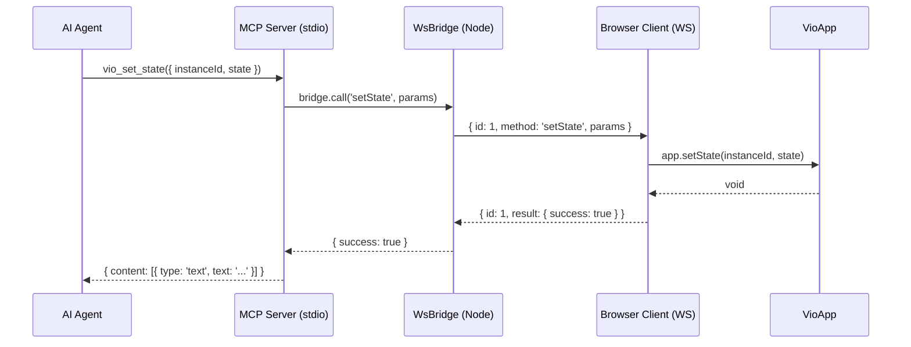

## From Framework API to Agent Tools with MCP

Configure an MCP server, point Claude at it, and suddenly the agent can inspect component trees, read and set state, dispatch store actions, navigate routes, and replay event history. No browser devtools open. No console. Just tool calls over stdio, and the app responds.

That's the setup for [Vio](https://github.com/atr0t0s/vio)'s devtools package. The [previous article](lab-vio-ai-first-framework.html) covered why Vio exposes a programmatic API instead of hiding state behind component closures. This article traces what happens when an agent actually calls one of those APIs. MCP speaks stdio. The app runs in a browser. There are three boundaries to cross -- stdio to Node, Node to WebSocket, WebSocket to the browser tab -- and each one has its own failure modes. I'll follow a single tool call through every layer.

### Eleven tools, one app API

The MCP server exposes 11 tools, grouped by what they do.

**Read operations** return data without side effects: `vio_get_state`, `vio_get_store`, `vio_get_component_tree`, `vio_get_registered_components`, `vio_get_event_history`. These are what the agent uses to understand the current state of the application.

**Write operations** mutate the app: `vio_set_state`, `vio_dispatch`, `vio_navigate`, `vio_emit`, `vio_remove_component`. Each one maps to a single method on the Vio app API.

**Compound operations**: `vio_batch` groups multiple writes into one call so the agent doesn't have to make five round-trips to set up a screen.

Every tool is defined as a `ToolDef` with a name, description, the WebSocket method it maps to, and a Zod input schema:

```typescript
export interface ToolDef {
  name: string
  description: string
  wsMethod: string
  inputSchema: Record<string, ZodType>
}
```

Three representative definitions:

```typescript
{
  name: 'vio_get_component_tree',
  description: 'Get the component tree with IDs, names, and state',
  wsMethod: 'getComponentTree',
  inputSchema: {}
},
{
  name: 'vio_set_state',
  description: 'Update the local state of a component (partial merge)',
  wsMethod: 'setState',
  inputSchema: {
    instanceId: z.string().describe('Component instance ID'),
    state: z.record(z.unknown()).describe('Partial state to merge')
  }
},
{
  name: 'vio_batch',
  description: 'Execute multiple operations atomically. Actions: setState, dispatch, removeComponent, navigate',
  wsMethod: 'batch',
  inputSchema: {
    operations: z.array(z.object({
      action: z.enum(['setState', 'dispatch', 'removeComponent', 'navigate']),
      target: z.string().optional().describe('Component ID or route path'),
      payload: z.unknown().optional().describe('Action-specific payload')
    })).describe('Array of operations to execute')
  }
}
```

Every tool is a 1:1 mapping to the app API. No convenience wrappers, no "smart" tools that chain multiple operations, no abstraction layer that guesses what the agent meant. The agent decides the sequence. The tools execute it.

A typical debugging session looks like this. The agent calls `vio_get_component_tree` to see what's mounted. It spots a component with unexpected state, calls `vio_get_state` with that instance ID. It sees the problem -- a filter is set to `'completed'` when it should be `'all'`. It calls `vio_set_state` to fix it. Then `vio_get_event_history` to confirm the state change event fired and no downstream errors followed. Four tool calls, each returning JSON the agent can reason about directly.

### What happens when the agent calls vio_set_state

Here's the specific call: `vio_set_state({ instanceId: 'todo-list-1', state: { filter: 'active' } })`. I'll trace it through every layer.

**Layer 1: MCP server.** The tool call arrives over stdio. The `registerTools` function has already looped over all 11 tool definitions and registered a handler for each one. Every handler does the same thing -- forward to the WebSocket bridge and wrap the result:

```typescript
export function registerTools(server: McpServer, bridge: WsBridge): void {
  for (const tool of TOOLS) {
    server.registerTool(
      tool.name,
      {
        description: tool.description,
        inputSchema: tool.inputSchema
      },
      async (params: Record<string, unknown>) => {
        try {
          const result = await bridge.call(tool.wsMethod, params)
          return {
            content: [{ type: 'text' as const, text: JSON.stringify(result, null, 2) }]
          }
        } catch (err) {
          const message = err instanceof Error ? err.message : String(err)
          return {
            content: [{ type: 'text' as const, text: `Error: ${message}` }],
            isError: true
          }
        }
      }
    )
  }
}
```

For our call, `tool.wsMethod` is `'setState'`, so the handler calls `bridge.call('setState', { instanceId: 'todo-list-1', state: { filter: 'active' } })`.

**Layer 2: WebSocket bridge.** `WsBridge.call()` creates a JSON-RPC-style request, sends it over the WebSocket, and stores a pending promise keyed by request ID:

```typescript
call(method: string, params: Record<string, unknown>): Promise<unknown> {
  return new Promise((resolve, reject) => {
    if (!this.isConnected()) {
      reject(new Error('No Vio app connected. Start your app and call connectDevtools(app).'))
      return
    }
    const req = createRequest(method, params)
    const timer = setTimeout(() => {
      this.pending.delete(req.id)
      reject(new Error(`Timeout: ${method} did not respond within ${this.timeout}ms`))
    }, this.timeout)
    this.pending.set(req.id, { resolve, reject, timer })
    this.client!.send(JSON.stringify(req))
  })
}
```

The wire format is defined in `protocol.ts`. Requests are `{ id, method, params }`. Responses are `{ id, result }` or `{ id, error: { message } }`. The `createRequest` function assigns a monotonically increasing ID:

```typescript
let nextId = 0

export function createRequest(method: string, params: Record<string, unknown>): WsRequest {
  return { id: ++nextId, method, params }
}
```

So the bridge sends `{ id: 1, method: 'setState', params: { instanceId: 'todo-list-1', state: { filter: 'active' } } }` over the WebSocket.

**Layer 3: Browser client.** On the other end, `connectDevtools(app)` has opened a WebSocket connection and registered an `onmessage` handler. When the message arrives, it looks up the method in `METHOD_MAP` and calls the corresponding app function:

```typescript
const METHOD_MAP: Record<string, MethodHandler> = {
  setState: (app, p) => {
    app.setState(p.instanceId as string, p.state as Record<string, unknown>)
    return { success: true }
  },
  // ... 10 more methods
}

ws.onmessage = (event) => {
  const req = JSON.parse(event.data as string) as WsRequest
  const handler = METHOD_MAP[req.method]
  if (!handler) {
    ws.send(JSON.stringify({ id: req.id, error: { message: `Unknown method: ${req.method}` } }))
    return
  }
  try {
    const result = handler(app, req.params)
    ws.send(JSON.stringify({ id: req.id, result }))
  } catch (err) {
    const message = err instanceof Error ? err.message : String(err)
    ws.send(JSON.stringify({ id: req.id, error: { message } }))
  }
}
```

The handler calls `app.setState('todo-list-1', { filter: 'active' })`, which triggers Vio's state merge, re-render, and event emission. Then it sends back `{ id: 1, result: { success: true } }`.

**Layer 4: Return path.** The bridge's `onmessage` handler matches the response ID to the pending promise, clears the timeout, and resolves with `{ success: true }`. The MCP handler wraps that in `{ content: [{ type: 'text', text: '{\n  "success": true\n}' }] }` and sends it back over stdio. The agent sees a successful result.

The full round-trip:



### Why WebSocket, why not HTTP

HTTP would be simpler to implement. POST the request, get the response. But the browser tab needs a persistent connection. The devtools server doesn't know when a browser tab opens -- the browser has to initiate the connection and keep it alive. With HTTP, the server would have to poll or the browser would have to long-poll, and both options add latency and complexity for something that WebSocket handles natively.

The protocol is JSON-RPC-like but not JSON-RPC 2.0. There's no `jsonrpc: "2.0"` field, no batch semantics, no notification support. Just `{ id, method, params }` for requests and `{ id, result }` or `{ id, error: { message } }` for responses. I didn't see a reason to implement the full spec when the communication is always one request, one response, between two known endpoints. The simplicity means the entire protocol fits in 25 lines of code.

The bridge allows one connection at a time. When a second browser tab connects, the first one gets disconnected. This is a simplification I chose deliberately. The MCP server talks to one app instance. The agent's mental model is "the app" -- singular. Supporting multiple simultaneous connections would mean every tool call needs a target parameter to specify which tab, and the agent would need to track connection IDs. For local development, one tab is the common case. The limitation is documented, not hidden.

### Three lines to agent control

Wiring up agent control takes three pieces.

In the browser, one line in your app's entry point:

```typescript
connectDevtools(app)
```

In the terminal, start the devtools server:

```bash
npx vio-devtools
```

In your MCP config for Claude (or any MCP-compatible client):

```json
{
  "mcpServers": {
    "vio-devtools": {
      "command": "node",
      "args": ["./packages/vio-devtools/dist/cli.js"],
      "env": {
        "VIO_DEVTOOLS_PORT": "3100"
      }
    }
  }
}
```

`vio-devtools` has zero runtime dependency on `vio` core. The browser client is typed against a `VioAppLike` interface, not the concrete `VioApp` class. Any object that implements the same method signatures works. This means you could wire it up to a non-Vio app that implements the same API surface, though I haven't tested that path.

### What's still broken

**No subscriptions.** MCP is request/response. There's no way for the server to push events to the agent unprompted. So the agent polls `vio_get_event_history` to see what happened since its last check. The event bus keeps 100 events in a circular buffer, which is enough for debugging sessions where the agent makes a change and immediately checks the result. But for monitoring -- watching an app over time and reacting to user interactions -- polling is wasteful and the 100-event window means the agent can miss bursts of activity.

**One tab at a time.** The second browser connection evicts the first. There's no way to debug a multi-tab setup or compare two running instances of the same app. For the single-app local dev case this is fine. For anything more complex, it's a blocker.

**5-second timeout.** The `WsBridge` constructor defaults to a 5000ms timeout. If the browser is under heavy load, or the app's state tree is large enough that serialization takes time, the call fails with a timeout error. The timeout is configurable at bridge construction time but not per-call. A `getComponentTree` on a large app probably needs more time than a `setState` on a small one, and there's no way to express that.

**No auth.** Anyone on localhost can connect to port 3100. The WebSocket server accepts all connections without authentication. For local development this is acceptable. For any shared environment or remote debugging scenario, it's a non-starter. Adding token-based auth to the WebSocket handshake is straightforward but not implemented.

MCP is request/response. A live UI changes continuously. The agent asks "what's the state?" and gets a snapshot. By the time it processes that snapshot and decides what to do, the state may have changed. The polling workaround -- call `get_event_history`, diff against previous results, react -- is pragmatic but crude. Server-sent events or a subscription protocol would solve this, but that's a different architecture than what MCP provides today.
